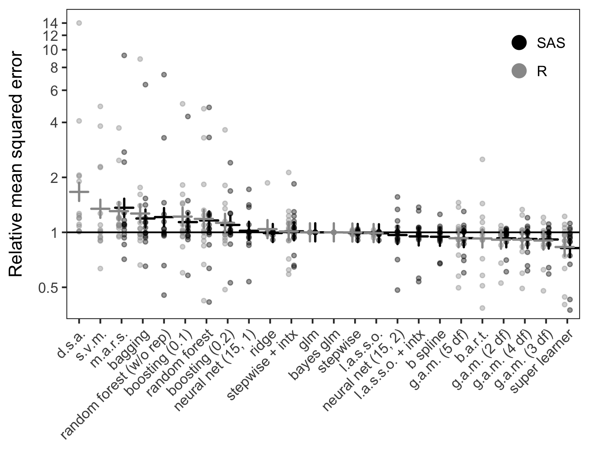

# SuperLearnerMacro
A SAS macro for stacking, a supervised ensemble machine learning approach to prediction

### Requirements
1. Windows 8+ or Red Hat Linux 7.1+ (untested on other versions)
2. SAS v 9.4+ (untested earlier versions)
3. SAS/STAT + SAS/OR v 14.1+ (untested earlier versions)

### Recommended enhancements
1. SAS Enterprise Miner High Performance Procedures 14.1+ (enables many data adaptive learners)
2. SAS/IML v 13.1+ (enables use of R functions)

### Quick start
Quick simulation example: predicting continuous outcomes in a validation sample by combining predictions from a linear regression, LASSO regression, and a generalized additive model

Place the following two lines at the top of your program:

    FILENAME slgh URL "https://raw.githubusercontent.com/CIRL-UNC/SuperLearnerMacro/9c7b712b074cda44a9a3acbb7a8b25bba32aab1e/super_learner_macro.sas";
    %INCLUDE slgh;
    

Simulate data

    DATA train valid ;
      LENGTH id x l 3;
      CALL STREAMINIT(1192887);
      DO id = 1 TO 1100;
        u = RAND("uniform")*0.1 + 0.4;  
        l = RAND("bernoulli", 1/(1+exp(-1 + u)));
        c = RAND("normal", u, 1);
        c2 = RAND("normal", u, .3);
        x = RAND("bernoulli", 1/(1+exp(-1.5 + 2*l + c + c2)));
        y = RAND("NORMAL", u + x, 0.5);
        KEEP x l c c2 y;
        IF id <= 100 THEN OUTPUT train;
        ELSE OUTPUT valid;
      END;
    RUN;

Call super learner macro

    TITLE "Super learner fit";
    %SuperLearner(Y=y,
                  X=x l c c2,
                  indata=train, 
                  preddata=valid, 
                  outdata=sl_output,
                  library= linreg lasso gampl,
                  folds=10, 
                  method=NNLS, 
                  dist=GAUSSIAN 
    );

Results: linear regression has lowest cross-validated expected loss (CVrisk), but LASSO also contributes to super learner fit.

           Super learner fit
    
    learner    Coefficient     CVrisk
    
    linreg       0.82097      0.23423
    lasso        0.17903      0.26555
    gampl        0.00000      0.30935
    
   
    
Estimate mean squared error
    
    DATA mse(KEEP=__train squarederror:);
     SET sl_output;
     squarederror_sl = (y - p_SL_full)**2;
     squarederror_linreg = (y - p_linreg_full)**2;
     squarederror_lasso = (y - p_lasso_full)**2;
     squarederror_gampl = (y - p_gampl_full)**2;
    PROC MEANS DATA = mse FW=5 MEAN;
     TITLE 'Mean squared error of predictions in training/validation data';
     VAR squarederror:;
     CLASS __train;
    RUN;
    
    
Results: super learner has lowest mean squared prediction error (validation data: __train=0)

    Mean squared error of predictions in training/validation data
                  The MEANS Procedure
   
                  N
    __train     Obs    Variable                Mean
    -----------------------------------------------
          0    1000    squarederror_sl        0.245
                       squarederror_linreg    0.247
                       squarederror_lasso     0.280
                       squarederror_gampl     0.247
   
          1     100    squarederror_sl        0.211
                       squarederror_linreg    0.209
                       squarederror_lasso     0.257
                       squarederror_gampl     0.207
    -----------------------------------------------

**[Click here for super learner macro documentation](docs/superlearnerhelp.html "Documentation")**

**[See the github page here](https://github.com/CIRL-UNC/SuperLearnerMacro "Github page")**
